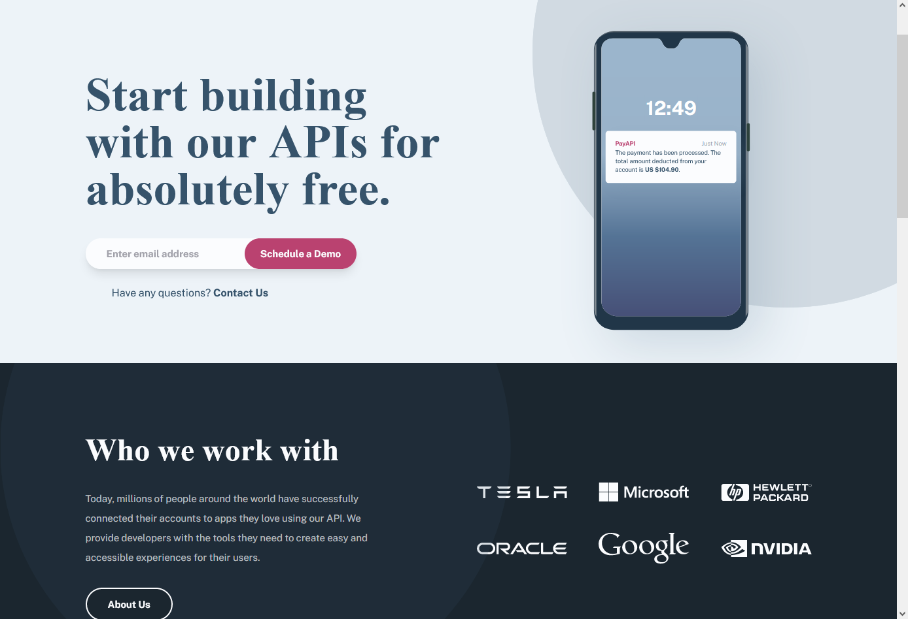
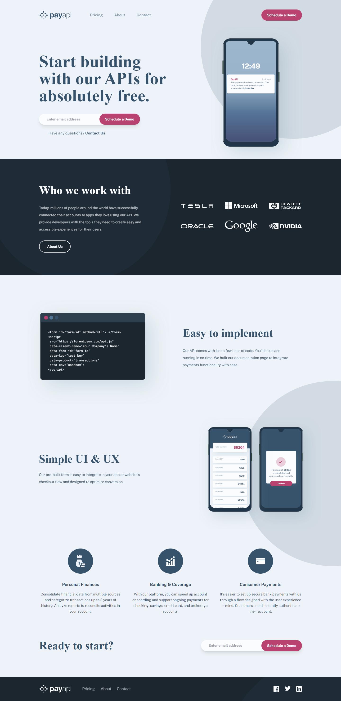
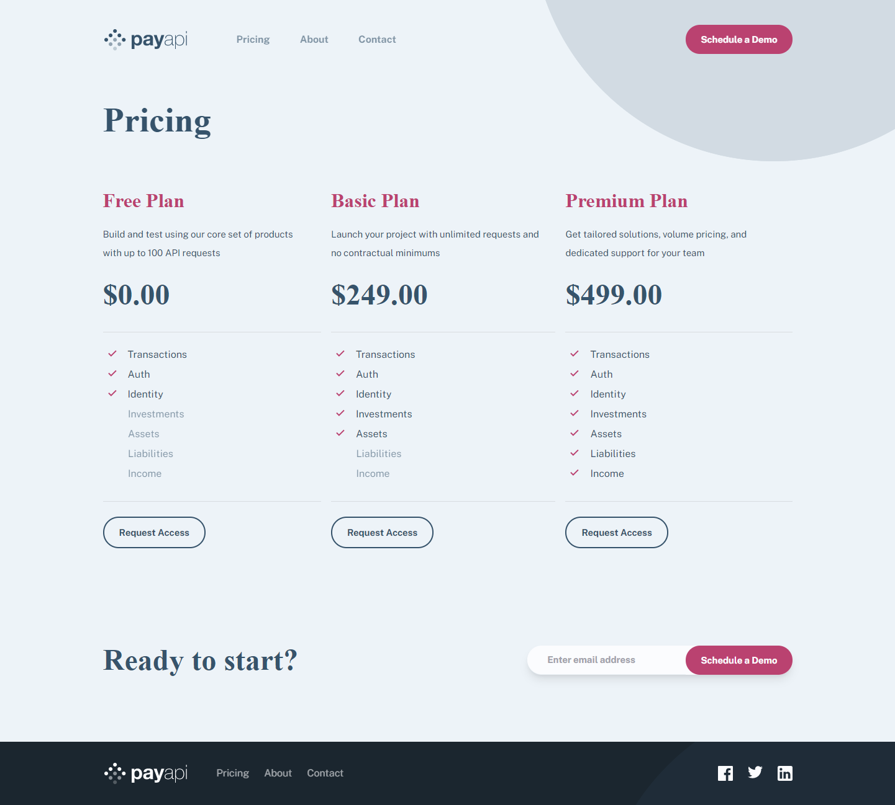
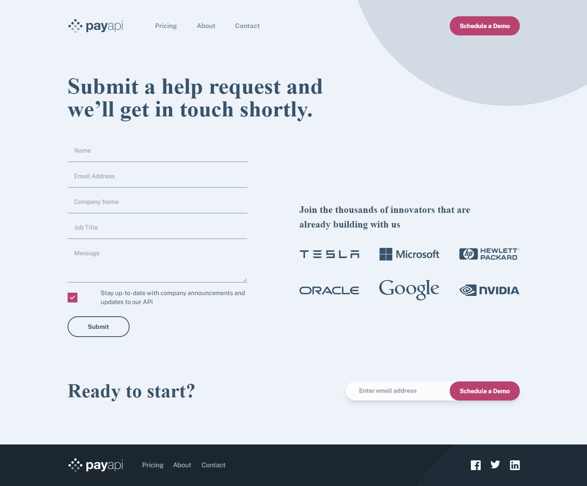
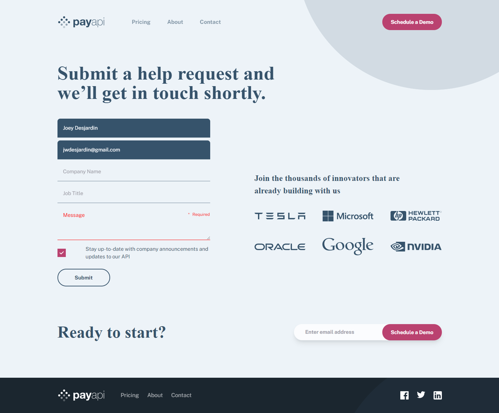

# Frontend Mentor - PayAPI multi-page website solution

This is a solution to the [PayAPI multi-page website challenge on Frontend Mentor](https://www.frontendmentor.io/challenges/payapi-multipage-website-FDLR1Y11e). Frontend Mentor challenges help you improve your coding skills by building realistic projects.

# Table of contents

- [Overview](#overview)
  - [The challenge](#the-challenge)
  - [Screenshot](#screenshots)
  - [Links](#links)
- [My process](#my-process)
  - [Built with](#built-with)
  - [What I learned](#what-i-learned)
    - [Using SVGs](#using-svg)
    - [Layout Component](#layout-component)
    - [Passing Query Strings](#passing-query-strings)
    - [Exit Animations](#exit-animations)
    - [Postioning Images](#postioning-images)
    - [Styling Forms](#styling-forms)
    - [Accessibility Styles](#accessibility-styles)
    - [Simple Input Validation](#simple-input-validation)
  - [Continued development](#continued-development)
  - [Useful resources](#useful-resources)
- [Author](#author)

# Overview

## The challenge

What i was given:

- Starter Files
  - HTML file with all text content typed out for each page.
  - Assets directory with all images assets needed
- Figma Design Files
  - Static Design for each page and each screen size
  - Design system page detailing colors, typography, buttons, checkbox, inputs.

Instructions given to me by frontendmentor:

```
Users should be able to:

- View the optimal layout for each page depending on their device's screen size
- See hover states for all interactive elements throughout the site
- Receive an error message when the contact form is submitted if:
  - The `Name`, `Email Address` or `Message` fields are empty should show "This field can't be empty"
  - The `Email Address` is not formatted correctly should show "Please use a valid email address"
```

## Screenshots of my finished project

### Homepage

| Homepage - Cropped                                                              | Homepage - Full                                                             |
| ------------------------------------------------------------------------------- | --------------------------------------------------------------------------- |
|  |  |

### About, Pricing

| About Page                                                          | Pricing Page                                                            |
| ------------------------------------------------------------------- | ----------------------------------------------------------------------- |
|  |  |

### Contact

| Contact - Fresh                                                                     | Contact - Error                                                                         |
| ----------------------------------------------------------------------------------- | --------------------------------------------------------------------------------------- |
|  |  |

### Links

- Solution URL: [Github Repo](https://github.com/jwdesjardin/payapi-multi-page-website)
- Live Site URL: [Live Demo](https://your-live-site-url.com)

# My process

## Built with

- Tailwind CSS
  > Using tailwind as much as possible was at the front of mind when building this. Breaking apart components where styles are reused. Using a well-built config file. Using pseudo selectors, postions, transforms . Using the JIT compiler for adding custom css classes.
- Next.js / React / Typescript
  > I want to continue with this stack for everything as it seems like a great option at the moment.
- SVG's (inline, img and object)
  > Not necessarily something I saw right away as a necessary part of the toolkit for this project but it quickly became obvious it was going to be a major part of this project.
- Custom form validation
  > In the past I have used Formik but just as a refresher of all that is going on under the hood in form validation I choose to write my own in this project.

## What I learned

**The biggest sections where i learned something new each have there own section below.**

## Using SVG

### Displaying svgs options

When displaying SVG's in a website there are three main ways that are used. Inline-SVG means to include the `<svg/>` html element and all of its children directly in your code.

The Image Tag method means to use the `` tag and refrence the location of the .svg file.
The Object tag method is similar to the Image tag method excpet we use the `<object/>` tag and this is handled a little differently in browsers.

**Inline-SVG**
code can conflict with other code in the context such as id names
css can change the SVG
changes can be made to the svg code locally and dynamically

**Img Tag**
all fonts must be included in SVG
cannot be changed by css
treated like an image by browsers

**Object Tag**
can be changed by css
code is seperate context then file
not given the img role

### Using Viewbox to scale

The original SVG's in this project were given a height and a width attribute. This works great when using the image Tag and is scalable as you would expect an image with these dimensions to be. When using the object tag or inline-svg with fixed dimensions like this the svg will not scale by default. In oder to get the scaling effect of svgs we want to replace the height and width with a `viewBox` value. A `viewBox` value is a string with the values `'x, y, width, height'` the width and height are used to set the aspect ratio of the scalable svg and the x and y (commonly used as 0, 0) are telling the `viewBox` where to start. If left at 0, 0 the viewBox will start in the top-left corner.

### Embedding fonts in SVG's - nano

When using the Image tag method or the Object tag method i was unable to use the font-families i had included in my CSS in rendered SVG. When using inline-svgs i was able to use these font-families. When using multiple svgs on the same page like i was doing on the homepage the inline-svg `id` attibutes began to conflict with each other causing parts of SVG to display incorrectly or not at all. When i render the SVG with the image tag or object tag the ids do not conflict. This leaves me in a spot where classes conflict when i use inline-svg but i cannot access the correct fonts asked for in my svg `<text>` elements if i use anything but inline-svg

Enter Embedded fonts into SVG's

This method puts all the information needed to display the font into the svg code. This makes the svg not dependant on font-family from CSS or other external sources. This method does have some drawbacks. First, file size can get large when you need to include all the information for fonts expecially if you need multiple fonts or font-weights. Second it can be difficult to download the files that you need, convert them to base64 encoding and then store them within your project and link to them within the SVG element.

This is why i used the nano service to drag and drop my svg files and have them automatically embed the fonts for me and compress the files to a size i can work with.

## Layout Component

I used the layout component to group all the components that were going to be the same for every page into a wrapper that i can then use to wrap each of my page componnents.

### Head component

The head component extends the `Head` component from `next/head`. The page title is passed from the Layout component to the head component to change the page title of each page easily.

### Navbar Component

The navbar component shows either a hamburger menu if the screen-size is mobile or a flex-row of links if the screen-size is tablet or above. The navbar component also uses a `z-index` to keep the navlinks sitting above any other objects such a `absolute` positioned images. In order to get `z-index` to take effect we need to make sure that the div is in affecting is postioned somthing other than `static`, we used `relative` in our navbar.

The menu controls state for the menu that will slide out when the hamburger button is clicked on mobile screensizes. The process of sliding the menu in and out is discussed in the Headless UI transition section.

## Passing Query Strings

### passing query string with next/link

To pass a query string with `next/link` you use the syntax as seen below and its as easy as that. The path that is created for this example is `/contact?email=EMAIL`

```tsx
<Link
	href={{
		pathname: '/contact',
		query: { email },
	}}
>
	<button className='button-primary w-full md:w-auto'>Schedule a Demo</button>
</Link>
```

### picking up query string with router and useEffect

In order to get the desired effect we want which is to have the emailComponent direct us to the contact page and prefill the email input portion of the form with what ever we typed into the form on the email component. In the page that contains our form we will need to collect this query string. To do this we use the `next/router` to get access to the current router. Then on pageload inside a React.useEffect with an empty dependency array we can access this instance of `router.query` and it will give us either a string or a string array. Because i am jsut expecting a string for the value of email in my case i check that i have the right type and then update the state on the page which in turn updates the controlled component for the email.

```tsx
React.useEffect(() => {
	let email = router.query.email
	if (typeof email === 'string') {
		setEmail(email)
	}
}, [router])
```

## Exit Animations

### why exit animations

Exit animations are used to animate when something is leaving the display and often coninsides with a a change of state or removing an element from the DOM. This is expecially hard when an item is being removed from the DOM becuase the removing the item cannot happen until the end of the animation

### keyframes solution

Using the keyframes solution you will use the following steps

1. build a keyframe animation for both the sliding in and sliding out animation
1. add this animation to a class including transition information such as duration
1. move the animated item offscreen and hidden to begin
1. when is state is triggered: set display add slidein class
1. when state is removed: remove slidein and add slideout; setTimout to set hidden

You can also not remove from DOM and leave offscreen with overflow:hidden on the body but i prefer to remove offscreen elemenets from the DOM if there are not meant to be used or interacted with.

### headless ui transition

Using the Headless UI 'Transition' component allows you to make exit animations much easier. The `show` attribute can be linked up with the boolean state that controls the display of the component and it will be removed from the DOM only after the exit animation has occured. Now you are given a place to include the enter styles which are consitent throughout the animation and the `enterFrom` and `enterTo` styles that will be animated over the duartion of the animation.

```tsx
<Transition
	show={menu}
	enter='transition ease-in-out duration-700 transform'
	enterFrom='translate-x-full'
	enterTo='translate-x-0'
	leave='transition ease-in-out duration-700 transform'
	leaveFrom='translate-x-0'
	leaveTo='translate-x-full'
	className='fixed right-0 top-0 h-screen w-10/12 bg-blue-900 md:hidden z-30'
>
	{/* ALL MY CODE FOR THE SLIDE OUT MENU DIV */}
</Transition>
```

## Postioning images

I positionned images in this proejc using a few different techinques.

- abosulte : translates bg circle (2 options relative layout or relative container)

For the background circles that are in various locations on different pages i ued the technique of postioning absolute with a location (top, left, right, bottom) to give a consitant postion. Then i used transform `TranslateX` and `TranslateY` to postion the element further. Ratios can be used on the translate properties and the postion will still be fxed on screen. The raltive container can either be the content container like on the homepage or the layout container or viewort on the about page.

- set width and tanslate text and image with shadow (sometimes absolute)
  Another technique i used to postion images was setting the width (and auto hight) of an image which if larger than the viewport width will be hidden offscreen. Then i use translate to postion the element or to postion other elements such as text content to cover parts of the image. This is great for the SVG images that haev shadow that you want to overlap. Sometimes absolute postioning can be good for the image that has shadow if you want the length of the image to be ignored by the parent conatiner.

- scalable bg iamge cover : about page
  On the about page in order to make the image stretch the whole screen evben on very large screens i used a div with a `background-image` `background-postion: center` and `background-size: cover`. The div also has a set height for each of the screen-sizes. The end effect is that the image will be rendered fully at the breakpoint sizes but at larger sizes the image will be shown in proper aspect ratio but increased resoltion to fill the entire screen.

## Styling Forms

I added custom styles to the form on the contact page. Each of the inputs used the same styles.

- input styles
- checkbox

For the checkbox i used display none to hide the default checkbox style. Then i my own div that controlled the checked state in the form. THe div got my unigue checkbox styles and then got positioned directly over the checkbox.

Using webkit snippet i was able to style to font color and highlight color when using autocomplete.

I used a error state to mark when a input had received a validation error. This changed the color until the class was removed which is triggered by a passing validaiton.

The error label was given a psedo content before of a `*` to add this to all messgaes. The error albel was then postioned abosulte inside the far left corner of the input.

## Accessibility Styles

I made a couple changes to the styles of my project in order to imporve accessability.

- focus outline white/black

One of the changes that i wanted to make was to change the outline color when links or inputs are focused. This provides more of a visible cue to your focused postion on the page and provides a better experience to users that use focus-tabing to navigate the webpage.

- active button / links

Another change i made was to add a active state with a unique background color to buttons or a unoque feature such as an underline or border on links. I liked this feature because it gives you a visual cue that you have clicked the button and can help users avoid unintended extra clicks on a button.

## Simple Input Validation

Inseated of using a form library like Formik for this project i decided to go the route of building everythign myself and this meant i needed to develop my own validation.

The first method that i used was validating the form on submit.

This was the validation code

```tsx
const validateForm = (name: string, email: string, message: string) => {
	const errors: { name?: string; email?: string; message?: string } = {}
	if (name === '') {
		errors.name = 'Required'
	} else if (email === '') {
		errors.email = 'Required'
	} else if (message === '') {
		errors.message = 'Required'
	} else if (/^[a-zA-Z0-9_.+-]+@[a-zA-Z0-9-]+\.[a-zA-Z0-9-.]+$/.test(email) === false) {
		errors.email = 'Please provide a valid email'
	}
	console.log(errors)
	return errors
}
```

This was the code that was wan when the code was submit.

```tsx
const submitForm: React.FormEventHandler<HTMLFormElement> = (e) => {
	e.preventDefault()

	const errors = validateForm(name, email, message)
	if (Object.keys(errors).length === 0) {
		setFormErrors({})
		setTimeout(() => {
			alert(
				`Name: ${name} , Email: ${email} , Company: ${company} , Title: ${title} , Message: ${message}, Checked: ${checked}`
			)
		}, 400)
	} else {
		setFormErrors(errors)
	}
}
```

Next I used a method to validate the code if the state for the items where being validated was changed.

This was the code used to validate the code on state changes

```tsx
React.useEffect(() => {
	setFormErrors({})
	const errors = validateForm(name, email, message)
	if (touchedName && errors?.name) {
		setFormErrors(errors)
	} else if (touchedEmail && errors?.email) {
		setFormErrors(errors)
	} else if (touchedMessage && errors.message) {
		setFormErrors(errors)
	}
}, [name, email, message, touchedName, touchedEmail, touchedMessage])
```

### Continued development

In future projects i will continue to

- Use tailwind config to setup project values
- mobile first
- - componnent first
    utility first workflows
- accessability first

### Useful resources

- [Youtube Video](https://www.youtube.com/watch?v=29roz7sYG38) - Youtube video showing how to use Headless UI with Transition. This example shows that you can style the Transition Component. Headless UI docs where also helpful for Transistion Component.
- [Iphone Spacing Issue - StackOverflow](https://stackoverflow.com/questions/4617872/white-space-showing-up-on-right-side-of-page-when-background-image-should-extend) - This led me to the solution for the iphoneX spacing issue. ensuring the body extends the full width of the screen.
  [Scale SVG's - CSS Tricks]("https://css-tricks.com/scale-svg/") - Explains the `viewBox` and `preserveAspectRatio` attributes to scale svgs
  [Embed Fonts - CSS Tricks]("https://css-tricks.com/using-custom-fonts-with-svg-in-an-image-tag/") - Explains the options for using fonts within SVG between inline, img and object tags. Explains the purpose of embeddeding fonts into svgs and the Nano tool for doing this.
  [xml:space="preserve - StackOverflow]("https://stackoverflow.com/questions/27499032/svg-text-element-with-whitespace-not-preserved-in-ie") - The question asked is not relevant but this is were i found the `xml:space="preserve"` attribute to fix the error in the easy implementation svg on the homepage.
  [Psuedo Selectors -Tailwind Labs Issue]("https://github.com/tailwindlabs/tailwindcss/discussions/2119") Feature request for pseduo selectors like before and after in tailwind. for my solution in this project i created a css global class and paired it up with my css.
  [next/link - Next.js Docs]("https://nextjs.org/docs/api-reference/next/link") - How to use the next/link library to pass query strings

## Author

- Website - [Joey Desjardin](https://www.joeydesjardin.com)
- Frontend Mentor - [@jwdesjardin](https://www.frontendmentor.io/profile/jwdesjardin)
- Twitter - [@joey_desjardin](https://twitter.com/joey_desjardin)
